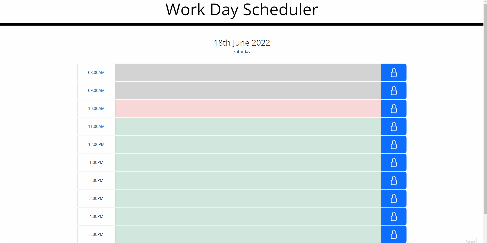
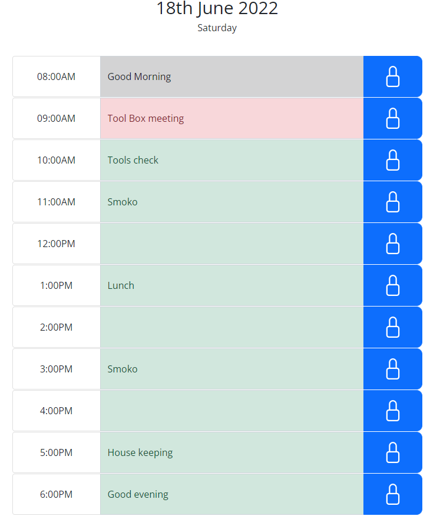
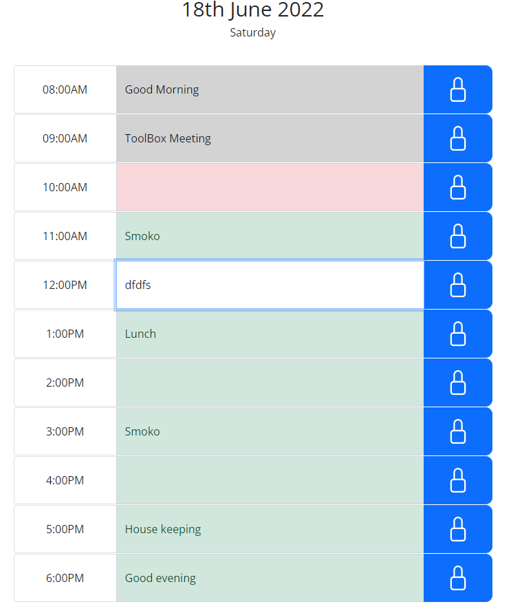

# Work Day Scheduler

# A simple calendar application that allows a user to save events for each hour of the day. 

Work Day Scheduler is an application which was assigned as the homework for week 5 of Monash University Bootcamp.

This code uses the Moment.js library to work with date and time and also Bootstrap for styling.

This app will run in Chrome and IE11, and  will feature dynamically updated HTML and CSS powered by JavaScript and Bootstrap. It has a clean and polished, responsive user interface that adapts to multiple screen sizes. // Please do not test this on Edge, moment.js is not functioning as expected in Edge

## Getting Started

This project has been deployed to GitHub Pages. To get this project up and running, you can follow the deployment link. Or download the sources files to use this as a template.

Git Hub

* [GitHub Repository] (https://github.com/gopinathkk/Work-Day-Scheduler.git )
* [Deployed GitHub] ( https://gopinathkk.github.io/Work-Day-Scheduler/)
* [Full Demo Video] (https://drive.google.com/file/d/1-vX91TP_nm80AR_esDxoYek9GGE2gMJU/view)

The following animation demonstrates the application functionality:

### Prerequisites

To install this application, you will need a text editor. I recommend Visual Studio Code. 

### Installing

To install this code, download the zip file, or use GitHub's guidelines to clone the repository. 

### Summary
this Simple day planner application is created using HTML , CSS and JavaScript supported by Bootstrap and Moment.js 
* This project emphasizes the use of Bootstrap and Moment.js along with jQuery to make dynamic changes to an HMTL document

  

### This project has the following features: 

* A single page work scheduler for the day
* Current day is displayed at the top of the planner.
* Eleven timeslots of standard business hours
* Each time block is color-coded to indicate whether it is in the past, present, or future
* User can click into the time block and enter an event
* A save button for each time block to store that event entry
 
* Text for that event is saved in local storage
* All schedules will be reset at the end of the day

### Psuedo Code and Project Requirements: 

AS an employee with a busy schedule
* I WANT to add important events to a daily planner
* SO THAT I can manage my time effectively
* GIVEN I am using a daily planner to create a schedule
* WHEN I open the planner
* THEN the current day is displayed at the top of the calendar
* WHEN I scroll down
* THEN I am presented with time blocks for standard business hours
* WHEN I view the time blocks for that day
* THEN each time block is color-coded to indicate whether it is in the past, present, or future
* WHEN I click into a time block
* THEN I can enter an event
* WHEN I click the save button for that time block
* THEN the text for that event is saved in local storage
* WHEN I refresh the page
* THEN the saved events persist
* End of the day the events will be cleared from scheduler and memory.

### This project has script features of:

 * Use Moment.js to get the date and time
 * Use Bootstrap text input fields and buttons
 * Functions to read text entries and store them on local storage with a date stamp.
 * Retrieve the stored data from local storage and display it 
 * Reset the local storage at the end of the day

### To Execute File:
> Open in browser

### Features: 
* One HTML Pages
    * index.html 
        * Contains user input items and buttons with divs and ids
        
* One CSS Page
    * styles.css
        * Contains cantering and styling for html user input features
    * Bootstrap
        * Buttons and text inputs and styling
        
* One JavaScript Page
    *script.js
    * Contains: 
        - Variables, including arrays 
        - Event listeners
        - if/else statements
        - Moment.js
        - Function to check current date and time
        - Function to read and store user entries at the text field
        - Function to buttons
        - Function to save and retrieve to and from local storage
        - Function to delete the user entries at end of day
        - An array to store the events and the date

* The following future improvements are considered:
    - store each day’s events with a date stamp and it can be retrieved at a later dates.
    - ability to select a future date and schedule events for the day.

          
## Authors
***Gopinath Krishnankutty [Git Hub Profile]https://github.com/gopinathkk
* Monash Univeristy :© 2022 Trilogy Education Services, LLC, a 2U, Inc. brand. Confidential and Proprietary. All Rights Reserved.

